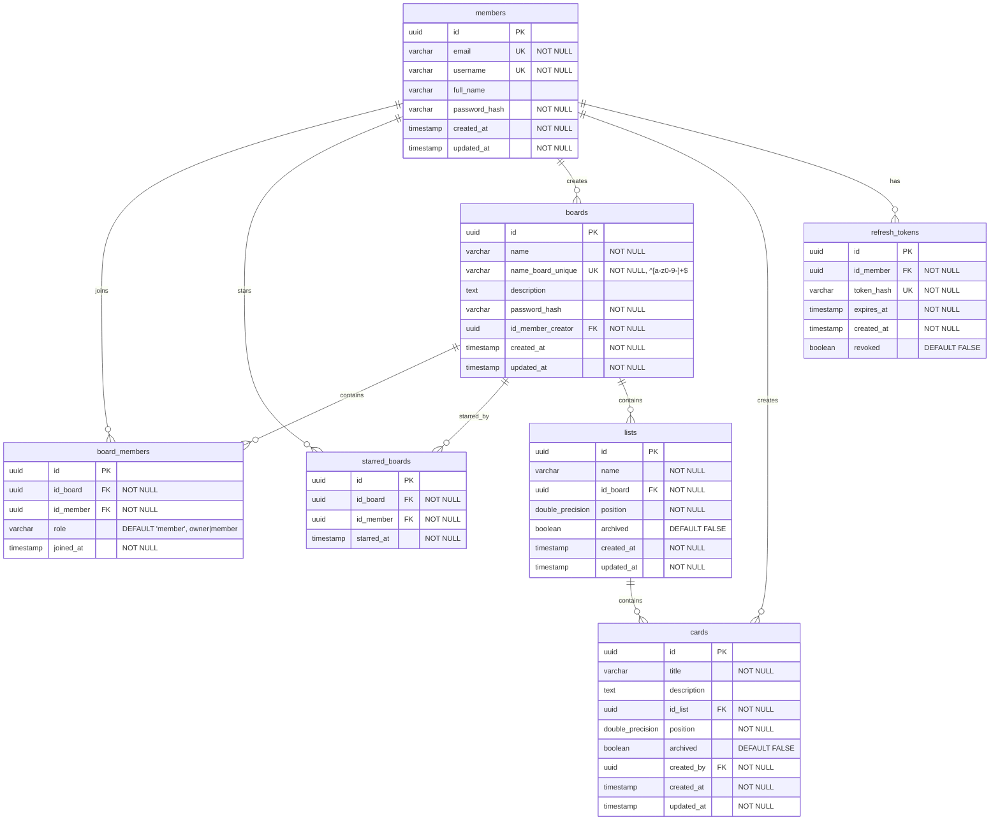

# OPENAPI v1
[/api/v1/api.swagger.yaml](./api/v1/api.swagger.yaml)

# TODO

## Database & Architecture
- [x] Design OpenAPI specification
- [x] Design database schema (members, boards, lists, cards, board_members, starred_boards)
- [x] Add unique index for `name_board_unique` field in boards table
- [x] Create database migrations
- [x] Set up database connection pool and configuration

## Project Structure
- [x] Set up Go project structure (handlers, services, repositories, models)
- [x] Configure dependencies
- [x] Set up configuration management (YAML/ENV)
- [x] Add logging middleware and error handling
- [x] Set up CORS and security middleware

## Authentication & Authorization
- [x] Implement JWT token generation and validation
- [x] Create access token and refresh token logic
- [x] Implement user registration endpoint
- [x] Implement user login endpoint
- [x] Implement token refresh endpoint
- [x] Add authentication middleware for protected routes
- [x] Implement password hashing (bcrypt)

## Members API
- [x] Implement GET /members/me (get current user info)
- [x] Implement PUT /members/me (update user profile)
- [x] Implement POST /members/boards/{nameBoardUnique}/join (join board by unique name)
- [x] Implement POST /members/boards/{idBoard}/star (star board)
- [x] Implement DELETE /members/boards/{idBoard}/star (unstar board)
- [x] Add validation for username/email uniqueness

## Boards API
- [x] Implement GET /boards (list user's boards with filters)
- [x] Implement POST /boards (create board with unique name validation)
- [x] Implement GET /boards/{idBoard} (get board with lists and members)
- [x] Implement PUT /boards/{idBoard} (update board, including name_board_unique)
- [x] Implement DELETE /boards/{idBoard} (delete board and cascade delete)
- [x] Implement DELETE /boards/{idBoard}/members/{idMember} (remove member/leave board)
- [x] Add board password validation logic
- [x] Validate name_board_unique format (lowercase, numbers, hyphens only)
- [x] Ensure name_board_unique uniqueness across all boards

## Lists API
- [x] Implement POST /lists (create list with fractional indexing)
- [x] Implement GET /lists/{idList} (get list with cards)
- [x] Implement PUT /lists/{idList} (update list name, position, archived status)
- [x] Implement DELETE /lists/{idList} (delete list and cascade delete)
- [x] Add fractional indexing logic for list positioning

## Cards API
- [ ] Implement POST /cards (create card in list)
- [ ] Implement GET /cards/{idCard} (get card details)
- [ ] Implement PUT /cards/{idCard} (update card, move between lists)
- [ ] Implement DELETE /cards/{idCard} (delete card)
- [ ] Add fractional indexing logic for card positioning

## Business Logic & Validation
- [x] Implement board membership check (access control)
- [x] Implement board ownership check (admin operations)
- [x] Add validation for already joined boards (409 conflict)
- [x] Add pagination support (limit/offset)
- [x] Implement starred boards filtering
- [ ] Add archived lists/cards filtering logic

## Testing
- [ ] Write unit tests for services
- [ ] Write integration tests for API endpoints
- [ ] Write tests for authentication middleware
- [ ] Write tests for database repositories
- [ ] Add test coverage reporting

## Deployment & DevOps
- [ ] Create Dockerfile
- [ ] Set up CI/CD pipeline
- [x] Configure production database
- [x] Set up environment-specific configs
- [x] Add health check endpoint

## Cascade relations scheme (mermaid)

```mermaid
flowchart TD
    subgraph Auth["🔐 Authentication"]
        M1[members]
        RT[refresh_tokens]
    end
    
    subgraph BoardMgmt["📋 Board Management"]
        B[boards]
        BM[board_members]
        SB[starred_boards]
    end
    
    subgraph Content["📝 Content"]
        L[lists]
        C[cards]
    end
    
    M1 -->|"1:N<br/>CASCADE"| RT
    M1 -->|"1:N<br/>creates"| B
    M1 -->|"N:M<br/>via board_members"| BM
    B -->|"N:M<br/>has members"| BM
    M1 -->|"N:M<br/>via starred_boards"| SB
    B -->|"N:M<br/>starred by"| SB
    B -->|"1:N<br/>CASCADE"| L
    L -->|"1:N<br/>CASCADE"| C
    M1 -->|"1:N<br/>created_by"| C
    
    style Auth fill:#e3f2fd
    style BoardMgmt fill:#fff3e0
    style Content fill:#f1f8e9
```

## Full database scheme (mermaid)

